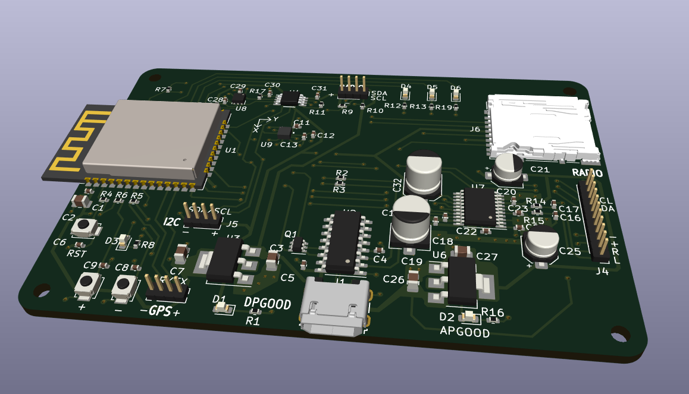

# Custom ESP32-Based PCB with Bluetooth & Sensor Integration

## Overview

Custom PCB built around the **ESP32** microcontroller. The board integrates multiple sensors and modules, making it suitable for applications such as **data logging, motion tracking, FM transmission, and GNSS-based navigation**

## Features
- **ESP32-WROOM-E**
- **TMP117AIDRVR Temperature Sensor**
- **MicroSD Card Reader**
- **TCA9517DGKRQ1 Level shifter for 5v I2C communication** 
- **PCM5102 DAC for Audio Processing**
- **I2C bus to FM Radio Transmitter**
- **LIS2DH12TR Accelerometer**
- **GNSS Receiver via UART**
- **3 User-Programmable Buttons**
## Requirements

- **ESP-IDF v5.3** – Required for firmware development and deployment.

## Applications

- **Wireless Sensor Hub** – Collect and transmit sensor data over Bluetooth.
- **Portable FM Transmitter** – Stream audio to nearby FM receivers.
- **Data Logger** – Store sensor data on an SD card for later analysis.
- **Motion & Position Tracking** – Use accelerometer and GNSS for movement-based applications.

## Getting Started

### 1. **Hardware Setup**

- Power the PCB via **USB or an external battery**.
- Connect necessary peripherals (antennas, audio sources, etc.).

### 2. **Firmware Development**

- Use the **ESP-IDF** or **Arduino IDE** to program the ESP32.
- Implement communication with the sensors and peripherals via **I2C, UART, and SPI**.

### 3. I2C Device addresses 
    TMP117AIDRVR: 0x48
    PCM5102: 0xC0
    LIS2DH12TR: 0x19